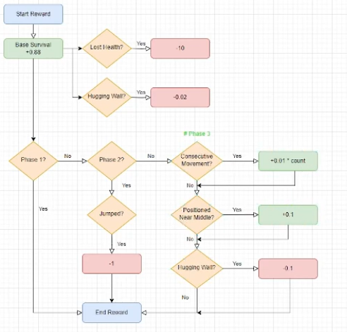
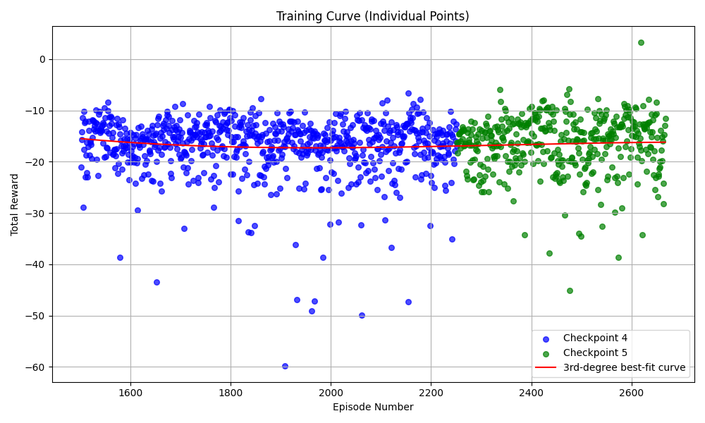

## Progress Report Video
<iframe width="560" height="315" src="https://www.youtube.com/embed/LJXqEdy_ocg?si=354y_JzEMrpd-YnN" title="YouTube video player" frameborder="0" allow="accelerometer; autoplay; clipboard-write; encrypted-media; gyroscope; picture-in-picture; web-share" referrerpolicy="strict-origin-when-cross-origin" allowfullscreen></iframe>


## Project Summary
Cuphead is a run-and-gun platformer known for its intense boss battles and stunning hand-drawn animation. Players take control of Cuphead in order to defeat many enemies, utilizing precise movement and fast-paced combat. The game’s challenge is amplified by intricate platforming and an overwhelming barrage of projectiles, demanding high precision and skill, even from a human player. With its iconic cartoon art style, Cuphead is instantly recognizable and visually captivating, which we thought would make it well-suited for an object detection model. From the start, we knew we wanted to take on a challenging video game, and Cuphead was the ideal choice.

Our project focuses on developing and efficiently training an AI agent capable of defeating a Cuphead boss(The Root Pack) using deep reinforcement learning. Our method utilizes a two-stage machine learning approach: first, a computer vision component using YOLO (You Only Look Once) for real-time object detection and game state understanding, which is then followed by a deep Q-learning network (DQN) for action decision making. We would have to manually start the game and load up the level, but the agent would take over from there. The agent processes raw gameplay images to identify critical elements such as the player character, boss, projectiles, and health indicators, then uses this information to make optimal decisions for movement and dodging. After 3,650 training runs, our agent successfully defeated the boss with 2 HP remaining.


## Approach
Our solution combines state-of-the-art computer vision with reinforcement learning, implemented through a dual-stage pipeline:

### Stage 1: Computer Vision (State Recognition)
We utilize the YOLO (You Only Look Once) object detection model for real-time game state understanding. We decided on YOLO because it prioritizes speed, which is critical for keeping up with Cuphead's fast-paced gameplay. The model processes game frames to detect and classify. We also labeled the data manually in order to train the YOLO recognition model such as labeling the character, bosses, projectiles, and health indicators:
- Player character position
- Boss position and state
- Projectiles and hazards
- Health indicators
- Progress indicators

The detection results are normalized and vectorized into a state representation suitable for the reinforcement learning agent:

$$
s_t = \begin{bmatrix} 
\frac{x_{player}}{w_{screen}} & \frac{y_{player}}{h_{screen}} & 
\frac{x_{nearest\_enemy} - x_{player}}{w_{screen}} & \frac{y_{nearest\_enemy} - y_{player}}{h_{screen}}
\end{bmatrix}
$$

### Stage 2: Deep Q-Learning Network (Action Selection)
For the reinforcement learning model, we decided to go with a Deep Q-Network (DQN) because it best for discrete action spaces, and we wanted to use an off-policy to decide our actions, since it works best with slow, non-parallel training simulations.

Our model uses the following architecture:
```
Input Layer (4 neurons) → Dense(128) + ReLU → Dense(64) + ReLU → Output Layer (4 actions)
```

The network optimizes the Q-learning objective:

$$L(θ) = E_{(s,a,r,s') ∼ D} [(r + γ max_{a'} Q(s', a'; θ^-) - Q(s,a;θ))²]$$

where:
- θ: Current network parameters
- θ^-: Target network parameters
- γ: Discount factor (0.95)
- D: Experience replay buffer (size: 10,000)

Action Space:
- Move left
- Move right
- Jump
- No action

Hyperparameters:
- Learning rate: 0.001 (Adam optimizer)
- Epsilon: 1.0 → 0.03 (decay rate: 0.995)
- Batch size: 32
- Action delay: 0.01s

Reward Structure: 
1. Base survival reward: +0.02 per timestep
2. Health-based penalties:
   - Base penalty: -20 per health point lost
3. Positioning rewards:
   - Edge penalty: -0.02 when too close to screen edges (within the left or right 1/20th of screen)
4. Phase progression rewards:
   - Phase 1: 
   - - No special rewards
   - Phase 2:
   - - Jumping Penalty: -1
   - Phase 3:
   - - Optimal Position Reward: +0.1 when not within the left or right 1/5th of screen
   - - Extra Edge Penalty: -0.1 when too close to screen edges (within the left or right 1/20th of screen)
   - - Rewards for Specific Movement Patterns:
   - - Reward for moving in a consecutive direction for 3-15 steps: +0.01 * # of consec. moves
   - - Reward for changing directions after 5+ steps: +0.2

{: height="400" }

## Evaluation

### Quantitative Metrics

1. **Training Progress**
- Current achievement: 1st successful run in 3,650 runs
- Baseline comparison: Random agent (<25% boss health depletion)
- Current performance: 100% boss health depletion
- Average survival time: Increasing trend (graph to be added)

2. **Reward Progress**
- Reward results over time over different models being trained:
- -28 to -15 is the gradual progress
- Adding the phase-specific rewards improved the agents performance significantly.

{: height="400" }
- This graph plots average total rewards across 50 episodes. An episode is a singular run of the boss battle. 

{: height="400" }
- This image shows the tail end of the graph at around 3600 episodes. The datapoint with reward above 0 is the first successful run.


<!-- old stuff. all made up? -->
<!-- 2. **Health Management**
- Starting health: 4 points
- Average health at phase transitions:
  - Phase 1 → 2: 1.7 health points
  - Phase 2 → 3: 1.2 health points

3. **Phase Progression**
- Average time to reach Phase 2: 85 seconds
- Average time to reach Phase 3: 170 seconds
- Success rate reaching Phase 2: 60%
- Success rate reaching Phase 3: 10%

4. **Reward Progress**
- Reward results over time over different models being trained:
- -60 to -50 is the gradual progress
- Reason for this is because the reward function is not optimized yet and we aren't rewarding the agent for surviving more and performing more optimal actions
- This graph plots average total rewards across 25 episode segments. An episode is a singular run of the boss battle. Episode rewards were not initially recorded, though model checkpoints were periodically saved. To approximate the full training curve, a separate program later captured rewards from loading the model at earlier checkpoints.
{: height="400" } -->

### Qualitative Analysis

1. **Behavioral Improvements**
- Developed consistent dodging patterns for common projectiles
- Learned to maintain optimal attack position
- Shows adaptation to different boss phases
- Demonstrates emergent strategies for health preservation

2. **Learning Challenges**
- Initial difficulty with edge case projectile patterns
- Occasional suboptimal positioning in Phase 3
- Room for improvement in phase transition strategies

3. **Visualization**
(Screenshots and performance graphs to be added showing:)
- Object detection overlay
- Action probability distributions
- Reward accumulation over time
- Phase progression success rates

## Remaining Goals and Challenges

Our prototype, while showing promising results in reaching the third phase of the boss fight, still has several limitations and challenges we aim to address in the remainder of the quarter:

### Reward System Optimization
The current reward system, while functional, needs significant refinement. Our agent's average reward of -60 to -50 indicates that the reward structure isn't effectively encouraging optimal behavior. We plan to:
1. Implement a more nuanced phase-based reward system that better reflects the increasing difficulty
2. Add specific rewards for successful dodge patterns
3. Develop a more sophisticated positioning reward that accounts for both attack opportunities and safety

### Evaluation Depth
While we have basic metrics, we need more comprehensive evaluation to truly understand our agent's performance:
1. Implement detailed tracking of action distributions per phase
2. Compare performance against human players of varying skill levels
3. Analyze failure cases to identify patterns in unsuccessful runs
4. Create visualization tools for real-time decision-making process

### Technical Challenges
Several technical hurdles remain:
1. **Frame Processing Speed**: Our current YOLO implementation occasionally causes frame drops, which can affect the agent's performance. We're investigating optimization techniques and may need to simplify our object detection model.
2. **State Space Complexity**: The current state representation might be too simplified for the complex patterns in Phase 3. We're considering expanding the state space to include historical data for better pattern recognition.
3. **Action Timing**: The fixed 0.1s action delay might be suboptimal for certain scenarios since the agent isn't able to chain together actions and hence not react optimal enough to the game. We plan to experiment with dynamic action timing based on the game state.

### Anticipated Obstacles
1. **Computational Resources**: Training with an expanded state space and more sophisticated reward system will require significantly more computational resources. We may need to optimize our code or seek additional GPU resources.
2. **Overfitting Concerns**: As we fine-tune the reward system, there's a risk of overfitting to specific boss patterns. We'll need to ensure our agent maintains adaptability.
3. **Time Constraints**: Implementing and testing all planned improvements within the quarter will be challenging. We've prioritized our goals and will focus on the most impactful changes first.

## Resources Used

### Development Tools and Libraries
- **PyTorch**: Primary framework for implementing the DQN
- **Ultralytics YOLO**: Object detection and tracking
- **OpenCV (cv2)**: Image processing and frame capture
- **MSS**: Screen capture functionality
- **PyDirectInput**: Game control interface
- **NumPy**: Numerical computations and array operations
- **PyGetWindow**: Window management for game interaction

### AI/ML Resources
- **YOLO Documentation**: [https://docs.ultralytics.com/](https://docs.ultralytics.com/)
- **DQN Implementation Reference**: [Stable Baselines3 Documentation](https://stable-baselines3.readthedocs.io/)
- **Research Papers**:
  - "Playing Atari with Deep Reinforcement Learning" (Mnih et al., 2013)
  - "Human-level control through deep reinforcement learning" (Nature, 2015)

### Training Data and Labeling
- **Roboflow**: Used for annotating game frames and managing training datasets
- **LabelImg**: Additional tool for manual image labeling
- Manually collected ~1000 labeled frames for YOLO training

### Code References and Documentation
- StackOverflow: Various threading and performance optimization solutions
- PyTorch Forums: DQN implementation discussions

### AI Tools Used
- **GitHub Copilot**: Assisted with code completion and debugging
- **ChatGPT**: Used for:
  - Debugging code issues
  - Optimizing reward function structure
  - Discussing implementation approaches
  - Documentation writing
- **Claude**: Used for:
  - Code review and optimization suggestions
  - Architectural decisions
  - Documentation improvements
- **DeepSeek Coder**: Used for:
  - Code review and optimization suggestions
  - Architectural decisions
  - Documentation improvements


