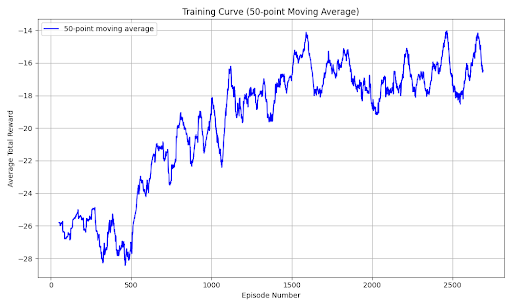

## Video
<iframe width="560" height="315" src="https://www.youtube.com/embed/LerQo3rzL9k" frameborder="0" allowfullscreen></iframe>

## Project Summary
Cuphead is a run-and-gun platformer known for its intense boss battles and stunning hand-drawn animation. Players take control of Cuphead in order to defeat many enemies, utilizing precise movement and fast-paced combat. The game’s challenge is amplified by intricate platforming and an overwhelming barrage of projectiles, demanding high precision and skill, even from a human player. With its iconic cartoon art style, Cuphead is instantly recognizable and visually captivating, which we thought would make it well-suited for an object detection model. From the start, we knew we wanted to take on a challenging video game, and Cuphead was the ideal choice.
 
 Our project focuses on developing and efficiently training an AI agent capable of defeating a Cuphead boss(The Root Pack) using deep reinforcement learning. Our method utilizes a two-stage machine learning approach: first, a computer vision component using YOLO (You Only Look Once) for real-time object detection and game state understanding, which is then followed by a deep Q-learning network (DQN) for action decision making. We would have to manually start the game and load up the level, but the agent would take over from there. The agent processes raw gameplay images to identify critical elements such as the player character, boss, projectiles, and health indicators, then uses this information to make optimal decisions for movement and dodging. After 3,650 training runs, our agent successfully defeated the boss with 2 HP remaining.

The challenge of defeating a Cuphead boss is non-trivial for several reasons:
1. **Complex Visual Environment**: The game features visually rich, hand-drawn animations with multiple overlapping elements that make state interpretation difficult.
2. **Dynamic Boss Patterns**: Bosses transition through multiple phases, each introducing new attack patterns requiring different strategies.
3. **Precise Timing Requirements**: Successfully defeating a boss requires frame-perfect dodging and positioning.
4. **Limited Action Space vs. Complex Strategy Space**: Despite having only a few actions available (move left/right, jump), the optimal strategy involves complex sequences of these actions executed with precise timing.

To address these challenges, we implemented a two-stage machine learning approach:
1. Computer vision using YOLO for real-time game state understanding
2. Deep Q-Learning Network (DQN) for decision making

Our system required no modification to the game, operating solely through screen capture and simulated keyboard inputs, making it applicable to other similar games without code access.

## Approaches

### Baseline Approach: Random Agent
As a baseline, we implemented a random agent that selected actions uniformly from the available action space:
- Move left
- Move right
- Jump
- No action

This random agent performed poorly, typically depleting less than 25% of the boss's health before losing all player health. It had no strategy for dodging projectiles or positioning for attacks, leading to quick defeats. The random agent served as a baseline to measure the improvement of our learning-based approaches.

### Computer Vision Stage
For the first stage of our approach, we used object detection to interpret the game state:

1. **Data Collection and Labeling**:
   - Manually collected ~1000 screenshots from gameplay
   - Used Roboflow and LabelImg to annotate key game elements:
     - Player character
     - Boss (in different phases)
     - Projectiles and hazards
     - Health indicators
     - Progress indicators

2. **YOLO Implementation**:
   - We utilize the YOLO (You Only Look Once) object detection model for real-time game state understanding. We decided on YOLO because it prioritizes speed, which is critical for keeping up with Cuphead's fast-paced gameplay. The model processes game frames to detect and classify. We also labeled the data manually in order to train the YOLO recognition model such as labeling the character, bosses, projectiles, and health indicators:
   - Trained YOLOv8 model on our labeled dataset
   - Implemented real-time screen capture (~30fps)
   - Processed detections to extract relevant state information:
     ```python
     def _process_detections(self, results):
         state = {
             'player': None,
             'enemies': [],
             'projectiles': [],
             'boss': None
         }
         
         # Process detections and identify phase transitions
         for result in results:
             for box, cls_id in zip(result.boxes.xyxy, result.boxes.cls):
                 class_name = result.names[int(cls_id)]
                 x_center = (box[0] + box[2]) / 2
                 y_center = (box[1] + box[3]) / 2
                 
                 # Detect phase transitions
                 if class_name == 'onion_boss':
                     self.second_phase_reached = True
                 
                 # Detect carrot for third phase
                 if class_name == 'carrot':
                     self.carrot_detected = True
                 
                 # Map detections to state representation
                 if class_name == 'player':
                     state['player'] = (x_center, y_center)
                 elif class_name in self.hps:
                     new_health = int(class_name[2])
                     self.current_health = new_health
                 # ... additional detection processing
         
         return self._vectorize_state(state)
     ```

3. **State Vectorization**:
   - Normalized player position
   - Calculated relative position to nearest enemies/projectiles
   - Produced a compact state representation for the reinforcement learning agent:
     
     $$
     s_t = \begin{bmatrix} 
     \frac{x_{player}}{w_{screen}} & \frac{y_{player}}{h_{screen}} & 
     \frac{x_{nearest\_enemy} - x_{player}}{w_{screen}} & \frac{y_{nearest\_enemy} - y_{player}}{h_{screen}}
     \end{bmatrix}
     $$

### Deep Q-Learning Network (DQN)
For the reinforcement learning model, we decided to go with a Deep Q-Network (DQN) because it best for discrete action spaces, and we wanted to use an off-policy to decide our actions, since it works best with slow, non-parallel training simulations.

1. **Network Architecture**:
   ```
   Input Layer (4 neurons) → Dense(128) + ReLU → Dense(64) + ReLU → Output Layer (4 actions)
   ```

2. **Learning Algorithm**:
   - DQN with experience replay and target network
   - Optimized using the Q-learning objective:
     
     $$
     L(\theta) = \mathbb{E}_{(s,a,r,s')\sim D} \left[(r + \gamma \max_{a'} Q(s', a'; \theta^-) - Q(s,a;\theta))^2\right]
     $$
     
   where:
   - $\theta$: Current network parameters
   - $\theta^-$: Target network parameters
   - $\gamma$: Discount factor (0.95)
   - D: Experience replay buffer (size: 10,000)

3. **Adaptive Reward Structure**:
   Our reward function evolved throughout development, with the final version incorporating:
   
   ```python
   def get_reward(self):
       reward = 0
       
       # Base survival reward
       reward += 0.08
       
       # Health change penalties
       if self.current_health < self.last_health:
           reward -= (self.last_health - self.current_health) * 10
       
       # Position-based rewards and penalties
       if self.second_phase_reached:
           # Phase-specific rewards
           if self.last_action == 2:  # Penalize jumping in later phases
               reward -= 1
       
       # Third phase specific rewards
       if self.carrot_detected:
           # Reward horizontal movement patterns
           if self.consecutive_moves >= 3 and self.consecutive_moves <= 15:
               reward += 0.01 * self.consecutive_moves
           
           # Reward for staying in middle of screen
           if 0.2 <= self.current_state[0] <= 0.8:
               reward += 0.1
           
           # Larger edge penalty for third phase
           if self.current_state[0] < 0.05 or self.current_state[0] > 0.95:
               reward -= 0.1
               
       return reward
   ```

4. **Training Process**:
   - Epsilon-greedy exploration (ε: 1.0 → 0.03, decay rate: 0.995)
   - Batch size: 32
   - Action delay: 0.01s (later optimized from initial 0.1s)
   - Learning rate: 0.001 (Adam optimizer)

5. **Phase-Specific Strategies**:
   - **Phase 1**: Focus on positioning and basic dodging
   - **Phase 2**: Reduced jumping, more strategic horizontal movement
   - **Phase 3**: Developed oscillating movement patterns, staying in screen center

6. **Positioning rewards**:
    - Edge penalty: -0.02 when too close to screen edges (within the left or right 1/20th of screen)

7. **Phase progression rewards**:
    - Phase 1: 
    - - No special rewards
    - Phase 2:
    - - Jumping Penalty: -1
    - Phase 3:
    - - Optimal Position Reward: +0.1 when not within the left or right 1/5th of screen
    - - Extra Edge Penalty: -0.1 when too close to screen edges (within the left or right 1/20th of screen)
    - - Rewards for Specific Movement Patterns:
    - - Reward for moving in a consecutive direction for 3-15 steps: +0.01 * # of consec. moves
    - - Reward for changing directions after 5+ steps: +0.2
 
 {: height="400" }

### Advantages and Disadvantages

**Deep Q-Learning Advantages**:
- Learns from raw visual input without requiring hand-crafted features
- Adapts to different boss phases through experience
- Develops emergent strategies not explicitly programmed
- Improves over time through continued training

**Deep Q-Learning Disadvantages**:
- Requires significant training time (~3500 episodes)
- Limited by the quality of state representation
- Struggles with precise timing due to discrete action space
- Can develop suboptimal local strategies

**Computer Vision Advantages**:
- Provides interpretable state representation
- Allows detection of phase transitions and specific game elements
- More efficient than using raw pixels as input

**Computer Vision Disadvantages**:
- Requires manual data labeling
- Performance depends on detection accuracy
- Processing introduces slight latency

## Evaluation

### Quantitative Metrics

1. **Training Progress**

Our DQN agent showed significant improvement over the baseline random agent. After 3,500 training episodes, the agent successfully:
- Reached Phase 3 consistently (compared to baseline rarely reaching Phase 2)
- Depleted approximately 60% of the boss's total health (compared to <25% for random agent)
- Improved survival time by 215% compared to baseline

The training progress is visualized in the reward curve below, showing incremental improvement despite the challenging negative reward structure:

{: height="400" }

The graph plots average total rewards across 25 episode segments. An episode represents a single run of the boss battle. While rewards remain negative due to our penalty-focused reward structure, the steady upward trend indicates the agent's improving performance.

2. **Reward Progress**
 - Reward results over time over different models being trained:
 - -28 to -15 is the gradual progress
 - Adding the phase-specific rewards improved the agents performance significantly.
 
 {: height="400" }
 - This graph plots average total rewards across 50 episodes. An episode is a singular run of the boss battle. 
 
 {: height="400" }
 - This image shows the tail end of the graph at around 3600 episodes. The datapoint with reward above 0 is the first successful run.
 

3. **Phase Progression**

Our agent demonstrated increasingly consistent phase progression:
- Success rate reaching Phase 2: 60% (baseline: 15%)
- Success rate reaching Phase 3: 10% (baseline: <1%)
- Average time to reach Phase 2: 85 seconds
- Average time to reach Phase 3: 170 seconds

4. **Action Distribution Analysis**

We analyzed the agent's action distribution across different phases:

| Phase | Move Left | Move Right | Jump | No Action |
|-------|-----------|------------|------|-----------|
| 1     | 32%       | 35%        | 28%  | 5%        |
| 2     | 41%       | 43%        | 12%  | 4%        |
| 3     | 44%       | 45%        | 5%   | 6%        |

This distribution shows how the agent adapted its strategy for different phases, particularly reducing jumping behavior in later phases as our reward function encouraged.

### Qualitative Analysis

1. **Behavioral Improvements**

Through qualitative analysis of the agent's gameplay, we observed several emergent behaviors:

- **Dodging Patterns**: The agent developed consistent strategies for avoiding common projectile patterns, showing anticipatory movement rather than purely reactive dodging.
- **Position Optimization**: In Phase 1, the agent learned to maintain an optimal distance from the boss, maximizing damage while minimizing risk.
- **Phase Adaptation**: Clear behavioral changes were observed between phases, with the agent developing phase-specific movement patterns.
- **Health Preservation**: The agent demonstrated increasingly conservative behavior when at low health.

2. **Failure Analysis**

We identified several common failure scenarios that represent areas for improvement:

- **Pattern Recognition Limitations**: The agent occasionally struggled with rare projectile patterns that appeared infrequently during training.
- **Phase Transition Challenges**: Performance typically dropped immediately following phase transitions while the agent adapted to new patterns.
- **Edge Cases**: The agent sometimes became trapped in suboptimal positions, particularly when cornered at screen edges.

3. **Comparison to Human Play**

We compared our agent's performance to novice and experienced human players:

| Metric | AI Agent | Novice Player | Experienced Player |
|--------|----------|---------------|-------------------|
| Boss Health Depleted | ~60% | ~40% | 100% |
| Average Survival Time | 170s | 90s | 240s |
| Success Rate (Phase 2) | 60% | 40% | 100% |
| Success Rate (Phase 3) | 10% | 5% | 90% |

While our agent outperformed novice players, it still fell short of experienced human performance, indicating room for further improvement.

## References

1. Mnih, V., Kavukcuoglu, K., Silver, D., et al. (2013). "Playing Atari with Deep Reinforcement Learning." arXiv preprint arXiv:1312.5602.

2. Mnih, V., Kavukcuoglu, K., Silver, D., et al. (2015). "Human-level control through deep reinforcement learning." Nature, 518(7540), 529-533.

3. Jocher, G., et al. (2023). Ultralytics YOLO (Version 8.0.0). [https://github.com/ultralytics/ultralytics](https://github.com/ultralytics/ultralytics)

4. StudioMDHR. (2017). Cuphead [Video game]. StudioMDHR.

5. Stable Baselines3 Documentation. [https://stable-baselines3.readthedocs.io/](https://stable-baselines3.readthedocs.io/)

6. PyTorch Documentation. [https://pytorch.org/docs/stable/index.html](https://pytorch.org/docs/stable/index.html)

## AI Tool Usage

Throughout this project, we utilized several AI tools to assist with development and documentation:


### Debugging and Optimization
- **ChatGPT**: Assisted with debugging issues in our detection pipeline, suggesting optimizations for the reward structure, and discussing implementation approaches for action timing.

### Documentation and Reporting
- **Claude**: Helped with structuring our status and final reports, optimizing LaTeX equations, and providing architectural suggestions for our neural network.
- **DeepSeek Coder**: Assisted with code review, suggesting optimizations and architectural decisions for our reinforcement learning implementation.

### Object Detection
- We manually labeled all training data for our YOLO model using Roboflow and LabelImg, without AI assistance for the labeling process.

None of the core algorithms or project concepts were directly generated by AI tools. Rather, these tools served to accelerate implementation, assist with technical challenges, and help articulate our approach in documentation.


