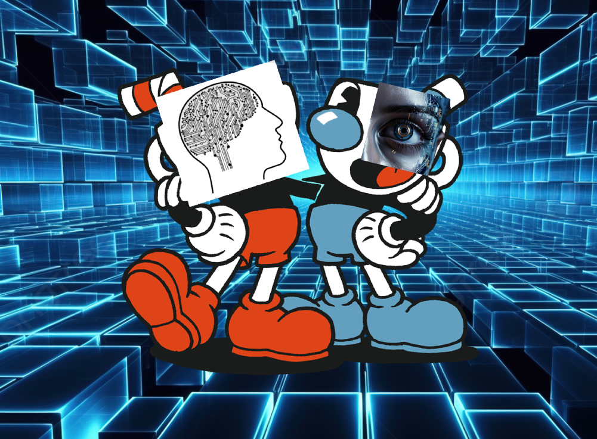
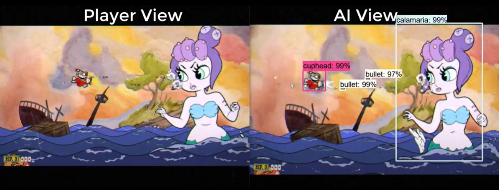

{: width="300" align="center"}

**Summary**
Our project involves training a reinforcement learning (RL) agent to play the game *Cuphead*, specifically to defeat the Root Pack boss fight. We use a YOLO object detection model to analyze the game's screen in real-time, then feed the data through a DQN which learns to make optimal decisions and execute inputs based on the observed state of the game. The project aims to explore the challenges of training AI in fast-paced, visually complex environments such as video games.

{: width="300"}

**Reports:**
 - [Proposal](proposal.html) 
 - [Status](status.html) 
 - [Final](final.html) 

**Source code:** 
[https://github.com/simonxcao/bots](https://github.com/simonxcao/bots)

**Sources**

- Our main inspiration and motivation to do this project was this YouTube videio by Develeper, which showed a functioning Cuphead agent. This video has some differences to our project such as their agent training on a very different boss, and their agent using tensorflow, while we used pytorch. Still, the video gave us inspiration of using an object detection model and training RL agent to output keypresses based on the locations of objects that the model sees.  
 [https://www.youtube.com/watch?v=wipq--gdIGM](https://www.youtube.com/watch?v=wipq--gdIGM)
  
 {: height="200"}

 - This is another video that we found helpful. It talks about object detection models in the game *Grand Theft Auto*. 
 [https://www.youtube.com/watch?v=hNv854R1Guo](https://www.youtube.com/watch?v=hNv854R1Guo)

 - This page was helpful in creating the object detection model.  
 [https://docs.ultralytics.com/models/yolo11/](https://docs.ultralytics.com/models/yolo11/)
 - We also created our own Cuphead dataset for object detection here: 
 [https://app.roboflow.com/cuphead-pj7jz/cuphead-objects/6](https://app.roboflow.com/cuphead-pj7jz/cuphead-objects/6)
 

